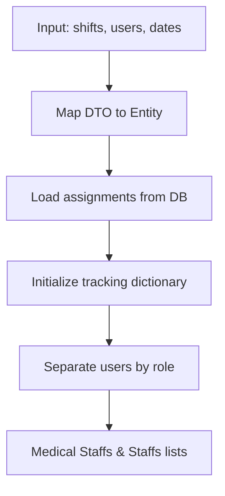
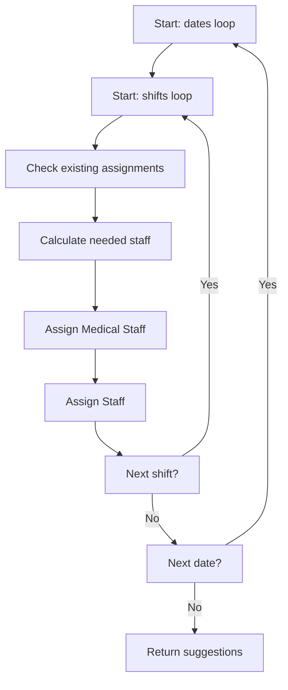
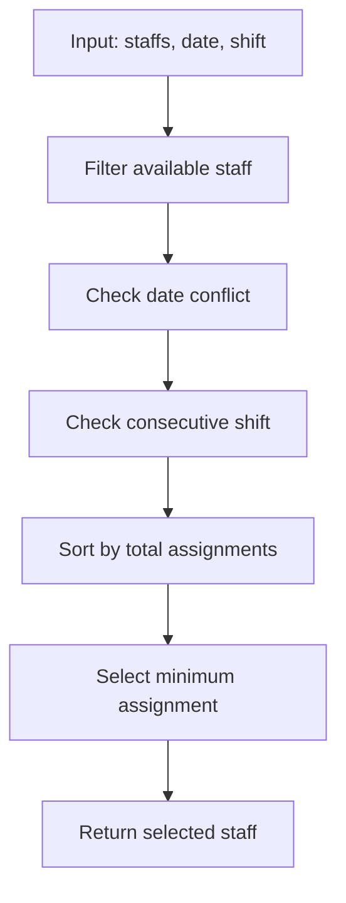
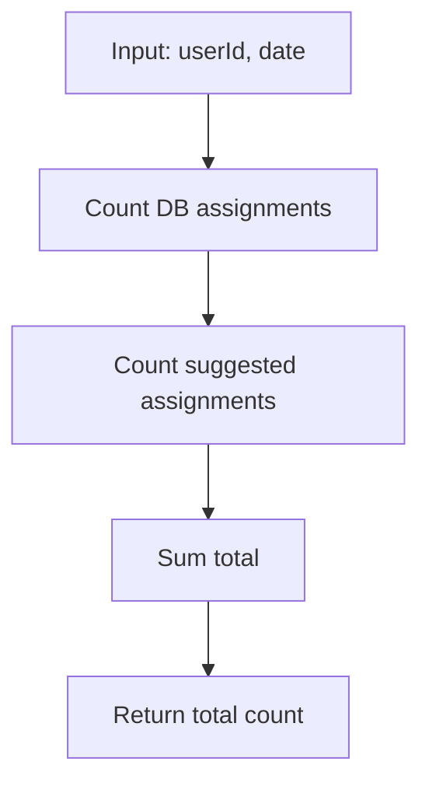

# TÀI LIỆU LUỒNG DỮ LIỆU - HỆ THỐNG PHÂN CÔNG CA LÀM VIỆC

## 1. TỔNG QUAN HỆ THỐNG

### 1.1 Mục đích
Hệ thống phân công ca làm việc tự động cho phòng lab xét nghiệm huyết thống, đảm bảo phân bổ đồng đều và công bằng cho tất cả nhân viên.

### 1.2 Yêu cầu nghiệp vụ
- Mỗi ca cần: 4 Staff + 3 Medical Staff
- Mỗi ngày có 2 ca: Morning và Afternoon
- Không phân công ca liên tiếp (Morning → Afternoon)
- Phân bổ đồng đều cho tất cả nhân viên
- Không giới hạn số ca tối đa/tháng

## 2. LUỒNG DỮ LIỆU CHI TIẾT

### 2.1 Input Data (Dữ liệu đầu vào)

```csharp
// Request từ Client
{
    "shifts": [
        { "shiftId": 1, "shiftName": "Morning", "startTime": "08:00", "endTime": "12:00" },
        { "shiftId": 2, "shiftName": "Afternoon", "startTime": "13:00", "endTime": "17:00" }
    ],
    "users": [
        { "userId": 1001, "name": "Staff A", "roleId": 2 },
        { "userId": 1002, "name": "Medical B", "roleId": 4 }
    ],
    "dates": ["2024-12-01", "2024-12-02", "2024-12-03"]
}
```

### 2.2 Data Processing Flow (Luồng xử lý dữ liệu)

#### Bước 1: Khởi tạo dữ liệu


#### Bước 2: Vòng lặp phân công


### 2.3 Core Algorithm (Thuật toán chính)

#### 2.3.1 FindNextAvailableStaff Method


#### 2.3.2 GetTotalAssignmentsInMonth Method


## 3. DATA STRUCTURES (Cấu trúc dữ liệu)

### 3.1 Tracking Dictionary
```csharp
Dictionary<(int UserId, int Year, int Month), int> suggestedCountPerUserPerMonth
```
- **Key**: (UserId, Year, Month) - Định danh duy nhất cho mỗi user trong mỗi tháng
- **Value**: Số ca đã gợi ý trong lần chạy hiện tại

### 3.2 Assignment Data
```csharp
List<ShiftAssignment> assignments // Từ database
```
- Chứa tất cả ca đã được phân công thủ công
- Được sử dụng để kiểm tra xung đột

### 3.3 Suggestion Result
```csharp
List<ShiftAssignmentSuggestionDTO> suggestions
```
- Kết quả cuối cùng trả về cho client
- Bao gồm thông tin chi tiết về mỗi gợi ý phân công

## 4. BUSINESS RULES (Quy tắc nghiệp vụ)

### 4.1 Ràng buộc phân công
1. **Số lượng nhân viên/ca:**
   - Medical Staff: 3 người
   - Staff: 4 người

2. **Ràng buộc thời gian:**
   - Không trùng ngày: Một nhân viên không thể làm 2 ca cùng ngày
   - Không ca liên tiếp: Không được làm Morning sau khi làm Afternoon ngày hôm trước

3. **Ràng buộc phân bổ:**
   - Ưu tiên nhân viên có ít ca nhất
   - Phân bổ đồng đều giữa các nhân viên

### 4.2 Logic ưu tiên
```csharp
// Thứ tự ưu tiên khi chọn nhân viên:
1. Không trùng ngày
2. Không ca liên tiếp  
3. Tổng số ca thấp nhất (DB + Suggested)
```

## 5. DATA FLOW EXAMPLES (Ví dụ luồng dữ liệu)

### 5.1 Ví dụ 1: Phân công ngày đầu tiên

**Input:**
- Ngày: 2024-12-01
- Ca: Morning
- Medical Staffs: [A(0 ca), B(0 ca), C(0 ca)]
- Staffs: [X(0 ca), Y(0 ca), Z(0 ca)]

**Process:**
1. Kiểm tra ca đã gán: 0 Medical, 0 Staff
2. Cần thêm: 3 Medical, 4 Staff
3. Chọn: A, B, C (Medical) và X, Y, Z (Staff)
4. Cập nhật counter: A(1), B(1), C(1), X(1), Y(1), Z(1)

**Output:**
- 3 gợi ý Medical Staff
- 4 gợi ý Staff

### 5.2 Ví dụ 2: Phân công ca tiếp theo

**Input:**
- Ngày: 2024-12-01
- Ca: Afternoon
- Medical Staffs: [A(1 ca), B(1 ca), C(1 ca)]
- Staffs: [X(1 ca), Y(1 ca), Z(1 ca)]

**Process:**
1. Kiểm tra ca đã gán: 0 Medical, 0 Staff
2. Cần thêm: 3 Medical, 4 Staff
3. Tất cả đều có 1 ca → chọn ngẫu nhiên
4. Cập nhật counter: A(2), B(2), C(2), X(2), Y(2), Z(2)

## 6. PERFORMANCE CONSIDERATIONS (Cân nhắc hiệu suất)

### 6.1 Time Complexity
- **O(n × m × p)** trong đó:
  - n = số ngày
  - m = số ca/ngày
  - p = số nhân viên

### 6.2 Memory Usage
- **Tracking Dictionary**: O(u × 12) với u = số user
- **Assignment List**: O(a) với a = số assignment trong DB
- **Suggestion List**: O(n × m × 7) với 7 = tổng nhân viên/ca

### 6.3 Optimization Strategies
1. **Index-based selection**: Sử dụng dictionary để truy cập nhanh
2. **Lazy loading**: Chỉ load assignments khi cần
3. **Batch processing**: Xử lý theo batch để giảm memory

## 7. ERROR HANDLING (Xử lý lỗi)

### 7.1 Các trường hợp lỗi có thể xảy ra
1. **Không đủ nhân viên**: Trả về danh sách rỗng
2. **Dữ liệu không hợp lệ**: Throw exception
3. **Database connection error**: Log và retry

### 7.2 Validation Rules
```csharp
// Kiểm tra input
- dates.Count > 0
- shifts.Count > 0  
- users.Count > 0
- users.Any(u => u.RoleId == 2) // Có Staff
- users.Any(u => u.RoleId == 4) // Có Medical Staff
```

## 8. TESTING SCENARIOS (Kịch bản kiểm thử)

### 8.1 Test Case 1: Phân công bình thường
- **Input**: 7 nhân viên, 3 ngày
- **Expected**: Mỗi người được phân công đồng đều

### 8.2 Test Case 2: Ít nhân viên
- **Input**: 3 nhân viên, 7 ngày
- **Expected**: Mỗi người làm nhiều ca, không bị giới hạn

### 8.3 Test Case 3: Có ca đã gán
- **Input**: Một số ca đã được gán thủ công
- **Expected**: Chỉ gợi ý cho ca còn thiếu

## 9. MAINTENANCE & MONITORING (Bảo trì & Giám sát)

### 9.1 Logging
- Log số lượng gợi ý được tạo
- Log thời gian xử lý
- Log các trường hợp lỗi

### 9.2 Metrics
- Response time
- Memory usage
- Success rate
- Distribution fairness

### 9.3 Future Enhancements
1. **Machine Learning**: Dự đoán nhu cầu nhân viên
2. **Dynamic Scheduling**: Điều chỉnh theo workload thực tế
3. **Preference-based**: Cho phép nhân viên đăng ký ca ưa thích

---

**Tài liệu này được cập nhật lần cuối:** 2024-12-19
**Phiên bản:** 1.0
**Tác giả:** AI Assistant 